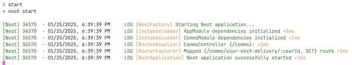
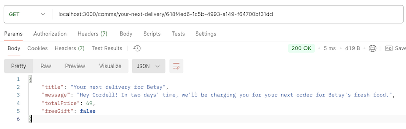

## Getting started

1. `npm install` to download dependencies

1. `npm run start` to start the server on http://localhost:3000

You should see the following output in the terminal:



## Calling the endpoint

Calling the `/comms` endpoint can be verified in a REST client such as [Postman](https://www.postman.com/) or [Insomnia](https://insomnia.rest/).

1. Copy the example URL:

```
localhost:3000/comms/your-next-delivery/618f4ed6-1c5b-4993-a149-f64700bf31dd
```

1. Make a `GET` request by pasting into your REST client:



## Tests

Unit tests can be run with:

```sh
npm run test
```

The `comms.service.spec.ts` includes test cases for the `title` field to ensure the value is formatted correctly with various numbers of cats. With more time, there would be test coverage for other service functionality such as calculating the total price, and eligibility for a free gift.

## Suggested improvements

In a production environment, some improvements are required, such as:

- Increased test coverage such as calculating total price and free gift eligibility
- Authentication and rate limiting to protect endpoints
- API schema should be defined in a way that allows a contract to be shared with client-side applications
